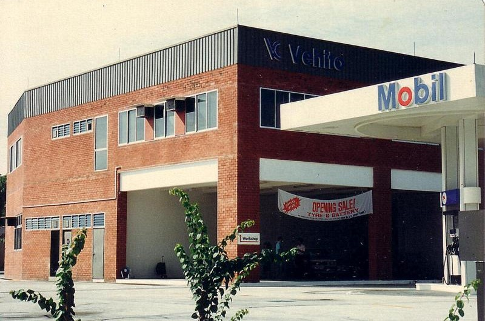

## History

<figure class="figure col-md-6 pe-md-3 float-start">
  
  <figcaption class=figure-caption>
    1st premise in 1987 over a Mobil station
  </figcaption>
</figure>

Bethany Christian Centre was birthed in fulfilment of prophecies. In July 1987,
Dr Anthony Phua stepped out in faith to plant a prophetic church. Bethany
started out in a big warehouse above a Mobil petrol kiosk station in Hougang
with a handful of people. It was a period of pilgrimage from the premises at the
petrol station to a rented nursery, and then to an auditorium in a commercial
school, until the purchase of the current property at 167 Yio Chu Kang Road in
September 1989. After renovations, 167 was dedicated in June 1992.

The church grew in numbers and we continued to worship in the premise for 2 over
decades. The building began to show signs of age over time. In 2018, members and
leaders of the church unanimously decided to rebuild the church. However, due to
the pandemic, we were forced to put the project on hold.

After 3 years of waiting and seeking God, the church decided to take the step of
faith to embark on the rebuilding amidst the challenges and rising cost hit by
the pandemic. After more than 2 years of rebuilding, Bethany Christian Center
reopened its door for worship at 167 on Easter Sunday, 31 March 2024. Praise be
to God!
